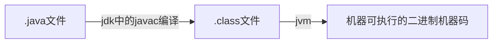

# java

## java基础

### jdk和jre的理解（jdk和jre的区别是什么）

#### JVM

java虚拟机（jvm）是运行java字节码的虚拟机。有针对不同系统的特定实现，目的是使用相同的字节码，它们都可以给出相同的结果。

**字节码？字节码的好处是什么**

jvm可以理解的代码叫做字节码（.class文件）

**java程序从源代码到运行**



**JDK和JRE**

- JDK 功能齐全的java SDK，拥有JRE所拥有的一切
- JRE java运行时环境，运行已编译Java程序所需的所有内容的集合，包括java虚拟机，java类库，java命令和其他的一些基础组件

#### 重载和重写的区别

**重载：同样的一个方法根据输入数据的不同，做出不一样的处理**

发生在同一个类中。。。

**重写：当子类继承自父类的相同方法，输入数据一样，但要做出有区别于父类的响应时就要覆盖父类方法**

发生在运行期

#### String/StringBuffer/StringBuilder

- String被final修饰，不可变
- StringBuffer是线程安全的
- StringBuilder是线程不安全的

#### 接口和抽象类的区别是什么？

抽象是对类的抽象，是一种模板设计，接口是对行为的抽象是一种行为规范

#### ==与equals

**==**

判断两个对象的地址是不是相等

- 基本数据类型==比较的是值
- 引用数据类型==比较的是内存地址

**equals**

判断两个对象是否相等

- 类没有覆盖`equals()`方法，则equals()等同于使用==比较两个对象
- 类覆盖了equals()方法，内容相等，返回true

#### hashCode与equals

hashCode() 的作用是获取哈希码

**为什么重写equals时必须重写hashCode方法**

1. 如果两个对象相等，hashCode一定相同
2. 两个对象相等，分别调用equals方法都返回true
3. 两个对象有相同的hashCode值，他们也不一定相等
4. 因此equals方法被覆盖，hashCode也必须被覆盖
5. hashCode()的默认行为是对堆上的对象产生独特值。如果没有重写hashCode方法，则该class的两个对象无论如何都不会相等

#### 反射

java反射机制是在运行时，对于任何一个类，都能够知道这个类的所有属性和方法。对于任何一个对象都能够调用它的任意一个方法和属性；

#### Java中的IO流  BIO/NIO/AIO

**Java中IO流分为几种**

- 流的流向分，输入流，输出流

- 操作单元，字节流和字符流

- 流的角色，节点流和处理流

  

****


## 集合

### Collection

#### List

有序，可重复，可通过索引值操作元素

- 底层是数组，查询快，增删慢
  - ArrayList	线程不安全，效率高
  - Vector      线程安全，效率低
- 底层是链表，查询慢，增删快
  - LinkedList	线程不安全，效率高

#### Set

无序，元素唯一

- 底层是哈希表

  - HashSet	保持元素唯一性

    hashCode（），equals（）

- 底层是二叉树

  - TreeSet	保证元素排序
    - 自然顺序，让对象所属的类去实现comparable接口，无参构造
    - 比较器接口comparator,带参构造

#### Queue

- PriorityQueue 数组来实现二叉堆
- ArrayQueue 数组+双指针

### Map

#### HashMap

数组+链表构成，当链表长度大于阈值（默认为8）（将链表转换为红黑树之前会判断，如果当前数组的长度小于64，那么会选择先进行数组扩容，而不是转红黑树）时会转化为红黑树

**默认初始大小16，每次扩容，容量变为之前的二倍 ，2 的幂次方**

```java
/**
 * Returns a power of two size for the given target capacity.
 */
static final int tableSizeFor(int cap) {
    int n = cap - 1;
    n |= n >>> 1;
    n |= n >>> 2;
    n |= n >>> 4;
    n |= n >>> 8;
    n |= n >>> 16;
    return (n < 0) ? 1 : (n >= MAXIMUM_CAPACITY) ? MAXIMUM_CAPACITY : n + 1;
}
```


**put原理**

1. 空数组有无初始化，没有就初始化
2. 如果通过key的hash能够直接找到值，跳转到6，否则到3
3. 如果hash冲突的话，链表/红黑树
4. 如果是链表，递归循环，把新元素追加到队尾
5. 如果是红黑树，调用红黑树新增的方法
6. 通过2，4，5将新元素追加成功后，再根据onlyIfAbsent判断是否需要覆盖
7. 判断是否需要扩容，需要扩容进行扩容，结束

#### LinkedHashMap

继承于HashMap

#### HashTable

数组+链表组成

默认初始大小11，每次扩容变为原来的2n+1


#### TreeMap

红黑树

### fail-fast（快速失败）

快速失败是java的集合的一种错误检测机制，

在使用迭代器对集合进行遍历时，在多线程环境下，操作非安全失败（fial-safe）的集合类可能会触发fail-fast。

在单线程下，如果在遍历集合过程中对集合对象的内容进行修改也会触发fail-fast

### fail-safe（安全失败）

采用安全失败机制的集合容器，在遍历时不时直接在集合内容上访问，而是先复制原有集合内容，在拷贝的集合上进行遍历。

原理：由于迭代时是对原集合的拷贝进行遍历，所以在遍历过程中对原集合所作的修改并不能被迭代器检测到，所以不会触发Concurrent Modification Exception。

缺点：基于拷贝内容的优点是避免了Concurrent Modification Exception，但同样地，迭代器并不能访问到修改后的内容，即：迭代器遍历的是开始遍历那一刻拿到的集合拷贝，在遍历期间原集合发生的修改迭代器是不知道的。

场景：java.util.concurrent包下的容器都是安全失败，可以在多线程下并发使用，并发修改。

### ConcurrentHashMap 和 Hashtable 的区别

- 底层数据结构：JDK1.7的ConcurrentHashMap 采用的是分段的数组+链表实现，JDK1.8之后跟hashmap一样，  hashtable使用数组+链表

- 实现线程安全的方式：

  hashtable：使用synchronized 全表锁，效率低

  ConcurrentHashMap ：

  - 1.7使用 分段锁，桶数组进行分割分段（segment）
  - 1.8采用synchronized +CAS，  摒弃segment概念，直接使用node数组+链表+红黑树的数据结构。synchronized只锁当前链表或红黑二叉树的首节点，所以只要hash不冲突，就不会产生并发。

### hashMap底层源码

### 

### arrayList扩容机制

### hashMap与hashSet区别

| hashMap                          | hashSet                                                      |
| -------------------------------- | ------------------------------------------------------------ |
| 实现了map接口                    | 实现了set接口                                                |
| 存储键值对                       | 仅存储对象                                                   |
| 调用put()向map中添加元素         | 调用add                                                      |
| hashMap使用键（key）计算hashCode | hashSet使用成员对象来计算hashCode值，对于两个对象来说HashCode可能相同，所以equals（）方法来判断对象的相等性 |


****


## JVM

### java内存区域

**线程私有**

- 程序计数器
- 本地方法栈
- 虚拟机栈

**所有线程共享**

- MetaSpace（元空间）
- 堆（数组和类对象）

### JVM如何加载.class文件

**通过classLoader将符合其格式要求的class文件加载到内存里并通过Execution Engine来解析class文件中的字节码提交给操作系统来执行**

### 类加载器

#### 类加载器的双亲委派机制

自底向上检查类是否已经加载，自顶向下尝试加载类

> Bootstrap ClassLoader（引导类加载器）
>
> Extension ClassLoader（扩展类加载器）
>
> Application ClassLoader（应用程序类加载器）
>
> Custom ClassLoader（自定义类加载器）

双亲委派机制可以避免多份同样字节码的加载

#### 类的加载方式

- 隐式：new
- 显式：loadClass，forname

##### loadClass与forname的区别

- loadClass得到的class是还没有链接的
- forname得到的class是已经被初始化的

> spring IOC的延迟加载
>
> IOC中资源加载器获取要读入的资源时，即读取bin的一些配置文件时，如果以classpath的方式来加载，需要使用ClassLoader.loadClass来加载
>
> 把类的加载工作留到实际使用的时候才去做

### JVM内存分配与回收

java堆是垃圾收集器管理的主要区域


垃圾回收角度，现在收集器基本都采用分代垃圾收集算法，所以java堆还可细分为：新生代和老年代

### 堆内存中对象的分配的基本策略

- 对象优先在eden区分配
- 大对象直接进入老年代
- 长期存活的对象将进入老年代

### 如何判断对象是否已经死亡

- 引用计数法
- 可达性分析算法

#### 强引用，软引用，弱引用，虚引用

- 强引用，必不可少，垃圾回收器绝不回收
- 软引用，可有可无，内存空间不足时，回收
- 弱引用，垃圾回收线程发现了就会回收
- 虚引用，对象持有虚引用就和没有任何引用一样，在任何时候都可能被垃圾回收。主要用来跟踪对象被垃圾回收的活动

### 如何判断一个类是无用的类

- 该类的所有实例已经被回收，java堆中不存在该类的任何实例
- 加载该类的ClassLoader已经被回收
- 该类对应的`java.lang.Class`对象没有在任何地方被引用，无法在任何地方通过反射访问该类的方法

### 垃圾收集有哪些算法，各自的特点

#### 标记清除算法

标记处所有不需要回收的对象，标记完成后统一回收掉所有没有被标记的对象

缺点

- 效率问题
- 会产生大量不连续的碎片

#### 复制算法

将内存分为大小相同的两块，每次使用其中一块，当这一块用完，就将还存活的对象复制到另一块中，然把使用的空间一次清理掉

#### 标记-整理算法

标记过程与标记清除算法一样，后续步骤不是直接对可回收对象回收，而是让所有存活的对象向一端移动，然后直接清理掉端边界以外的内存。

#### 分代收集算法

一般将 java 堆分为新生代和老年代，这样我们就可以根据各个年代的特点选择合适的垃圾收集算法

### 垃圾收集器

DK1.8 默认使用的是 Parallel Scavenge + Parallel Old

**Serial 收集器（串行收集器）**

在进行垃圾收集工作的时候必须暂停其他所有的工作线程（ **"Stop The World"** ），直到它收集结束

新生代采用标记-复制算法，老年代采用标记-整理算法


**ParNew 收集器**

ParNew 收集器其实就是 Serial 收集器的多线程版本

是许多运行在 Server 模式下的虚拟机的首要选择

它能与 CMS 收集器（真正意义上的并发收集器，后面会介绍到）配合工作


**parallel Scavenge 收集器**

关注点是吞吐量（高效率的利用 CPU），CMS 等垃圾收集器的关注点更多的是用户线程的停顿时间（提高用户体验）

使用标记-复制算法的多线程收集器


**Serial Old 收集器：**

 Serial 收集器的老年代版本


**Parallel Old 收集器：**

Parallel Scavenge 收集器的老年代版本


**CMS收集器**

是一种以获取最短回收停顿时间为目标的收集器

第一次实现了让垃圾收集线程与用户线程（基本上）同时工作


**G1收集器**

面向服务器的垃圾收集器

主要针对配备多颗处理器及大容量内存的机器. 以极高概率满足 GC 停顿时间要求的同时,还具备高吞吐量性能特征

**G1 收集器在后台维护了一个优先列表，每次根据允许的收集时间，优先选择回收价值最大的 Region(这也就是它的名字 Garbage-First 的由来)**


### GC策略

- Partial GC:并不收集整个GC堆的模式
  - Young GC：只收集young gen的GC
  - Old GC：只收集old gen的GC。只有CMS的concurrent collection是这个模式
  - Mixed GC：收集整个young gen以及部分old gen的GC。只有G1有这个模式
- Full GC：收集整个堆，包括 young gen，old gen，perm gen 等所有部分的模式

#### 触发条件

**young GC**

当young gen中的eden区分配满的时候触发，young gc中有部分存活对象会晋升到old gen，所以young gc后 old gen的占用量会升高

**full GC**

- System.gc()
- heapdump带GC
- 当准备触发一次young GC时，如果发现统计数据说之前youngGC的平均晋升大小比目前的old gen剩余的空间大，则不会触发young GC而是转为触发full GC

### JVM三大性能调优参数  -Xss -Xmx -Xss的含义

- -Xss：规定了每个线程虚拟机栈的大小
- -Xms ：堆的初始值
- -Xmx：堆能达到的最大值

**当计算机内存为4G，Xms，Xmx都设置成4G， 一段时间后内存崩溃**

从Java 8开始，如果我们没有指定 Metaspace 的大小，随着更多类的创建，虚拟机会耗尽所有可用的系统内存（永久代并不会出现这种情况）。

~~~java
-XX:MetaspaceSize=N //设置 Metaspace 的初始（和最小大小）
-XX:MaxMetaspaceSize=N //设置 Metaspace 的最大大小，如果不指定大小的话，随着更多类的创建，虚拟机会耗尽所有可用的系统内存。

~~~


****


## Java并发

### sleep()方法和wait()方法的区别和共同点

- 两者的区别在于，sleep()方法没有释放锁，wait()方法释放了锁
- 两者都可以暂停线程的执行
- wait通常被用于线程间交互/通信，sleep通常用于暂停执行
- wait方法被调用后，线程不会自动苏醒，需要等别的线程调用同一个对象上的notify()/notifyAll()。sleep方法执行完成后，线程自动苏醒。

### 为什么我们调用start()方法时会执行run()方法，为什么不能直接调用run()方法

 **调用start方法方可启动线程并使线程进入就绪状态，而run方法只是thread的一个普通方法调用，还是在主线程里执行**

### synchronized关键字

#### 使用方式

1. 修饰实例方法

   给当前对象实例加锁

2. 修饰静态方法

   给当前类加锁

3. 修饰代码块

   `synchronized(this|object)` 表示进入同步代码块要获取给定对象的锁

   `synchronized(类.class)`表示要获取当前class的锁

#### 双重校验锁实现对象单例（线程安全）

~~~java
public	class	Singleton{
    private	volatite static Singleton uniqueInstance;
    private Singleton(){
        
    }
    public	static	Singleton	getUniqueInstance(){
        //先判断对象是否被实例化过，没有实例化才进入加锁代码
        if(uniqueInstance==null){
            //给类对象加锁
            synchronized(Singleton.class){
                if(uniqueInstance==null){
                    uniqueInstance=new	Singleton();
                }
            }
        }
        return uniqueInstance;
    }
}
~~~

#### synchronized和ReentrantLock的区别

- 两者都是可重入锁
- synchronized依赖于JVM，ReentrantLock依赖于API
- ReentrantLock比synchronized增加了一些高级功能
  - 等待可中断
  - 可实现公平锁
  - 可实现选择性通知

### volatile 关键字

**（联合JMM来想）**

**`volatile` 关键字 除了防止 JVM 的指令重排 ，还有一个重要的作用就是保证变量的可见性。**

变量声明为**`volatile`**，这就指示 JVM，这个变量是共享且不稳定的，每次使用它都到主存中进行读取

### synchronized 关键字和 volatile 关键字的区别

synchronized 和 volatile 是互补的

- volatile 是线程同步的轻量级实现，volatile 只能用于变量，而synchronized 可以哦修饰方法以及代码块
- volatile 只能保持数据的可见性，synchronized 能保持原子性和可见性
- volatile 主要用于解决变量在多个线程之间的可见性。而synchronized 解决的是多个线程访问资源的同步性

### jvm内存结构与java内存模型（JMM）的区别

**jvm内存结构**

Java 虚拟机在执行 Java 程序的过程中会把它管理的内存划分成若干个不同的数据区域

线程私有：虚拟机栈，本地方法栈，程序计数器

所有线程共享：元空间，堆

**JMM**

java内存模型其实是一个抽象概念，描述了一种规则或规范。定义程序中各个变量的访问方式


### Java创建线程的四种方式

- 继承Thread类实现多线程
- 覆写Runnable()接口实现多线程，而后同样覆写run()，推荐此方式
  - 继承Thread和实现Runnable()接口的区别
    - 实现Runnable()避免多继承局限
    - 实现Runnable()可以更好的体现共享的概念
- 覆写Callable接口实现多线程
- 通过线程池启动多线程

### ThreadPoolExecutor的重要参数

**`ThreadPoolExecutor` 3 个最重要的参数：**

- **`corePoolSize` :** 核心线程数定义了最小可以同时运行的线程数量。
- **`maximumPoolSize` :** 当队列中存放的任务达到队列容量的时候，当前可以同时运行的线程数量变为最大线程数。
- **`workQueue`:** 当新任务来的时候会先判断当前运行的线程数量是否达到核心线程数，如果达到的话，新任务就会被存放在队列中。

`ThreadPoolExecutor`其他常见参数:

1. **`keepAliveTime`**:当线程池中的线程数量大于 `corePoolSize` 的时候，如果这时没有新的任务提交，核心线程外的线程不会立即销毁，而是会等待，直到等待的时间超过了 `keepAliveTime`才会被回收销毁；
2. **`unit`** : `keepAliveTime` 参数的时间单位。
3. **`threadFactory`** :executor 创建新线程的时候会用到。
4. **`handler`** :饱和策略。关于饱和策略下面单独介绍一下
   1. **`ThreadPoolExecutor.AbortPolicy`：** 抛出 `RejectedExecutionException`来拒绝新任务的处理。（默认）
   2. **`ThreadPoolExecutor.CallerRunsPolicy`：** 调用执行自己的线程运行任务，也就是直接在调用`execute`方法的线程中运行(`run`)被拒绝的任务，如果执行程序已关闭，则会丢弃该任务。因此这种策略会降低对于新任务提交速度，影响程序的整体性能。如果您的应用程序可以承受此延迟并且你要求任何一个任务请求都要被执行的话，你可以选择这个策略 ----- 著作权归Guide哥所有。
   3. **`ThreadPoolExecutor.DiscardPolicy`：** 不处理新任务，直接丢弃掉。
   4. **`ThreadPoolExecutor.DiscardOldestPolicy`：** 此策略将丢弃最早的未处理的任务请求。


**对于 IO 密集型的操作我们一般设置：线程数 = 2 * CPU 数量 + 1**

**对于 CPU 密集型的操作一般设置：线程数 = CPU 数量 + 1**

### AQS

是一个构建锁和同步器的框架

核心思想：如果被请求的共享资源空闲，则将当前请求的线程设置为有效的工作线程，并且将共享资源设置为锁定状态。如果当前被请求的共享资源被占用，那么就需要一套线程阻塞等待以及被唤醒时锁的分配的机制，这个机制AQS是用CLH队列锁实现的，将暂时获取不到锁的线程加入到队列中

**AQS对资源的共享方式**

- 独占
- 共享

### CountDownLatch 

CountDownLatch 允许count个线程阻塞在一个地方，知道所有线程的任务都执行完毕

- CountDownLatch 是共享锁的一种实现，默认构造AQS的state值为count。
- 当线程调用countDown()方法时，以CAS的操作来减少state，直到state为0。
- 当调用await()方法的时候，如果state不为0，说明任务还没有执行完毕，await()方法就会一直阻塞，await()方法后的语句不会被执行。
- CountDownLatch 会自旋CAS判断state==0，如果state==0就会释放所有等待的线程，await方法治好的语句会被执行。

CountDownLatch 的用法：

1. **某一线程在开始运行前等待 n 个线程执行完毕。**
2. **实现多个线程开始执行任务的最大并行性。**、


### CyclicBarrier(循环栅栏)

`CountDownLatch` 的实现是基于 AQS 的

`CycliBarrier` 是基于 `ReentrantLock`(`ReentrantLock` 也属于 AQS 同步器)和 `Condition` 的 

`CyclicBarrier` 的字面意思是可循环使用（Cyclic）的屏障（Barrier）。它要做的事情是：让一组线程到达一个屏障（也可以叫同步点）时被阻塞，直到最后一个线程到达屏障时，屏障才会开门，所有被屏障拦截的线程才会继续干活。 

`CyclicBarrier` 默认的构造方法是 `CyclicBarrier(int parties)`，其参数表示屏障拦截的线程数量，每个线程调用 `await()` 方法告诉 `CyclicBarrier` 我已经到达了屏障，然后当前线程被阻塞。

基本步骤：

```java
// 需要同步的线程数量
  private static final CyclicBarrier cyclicBarrier = new CyclicBarrier(5);
// 线程池for循环执行多线程任务，执行调用test

public static void test(int threadnum) throws InterruptedException, 		BrokenBarrierException {
    System.out.println("threadnum:" + threadnum + "is ready");
    try {
      /**等待60秒，保证子线程完全执行结束*/
      cyclicBarrier.await(60, TimeUnit.SECONDS);
    } catch (Exception e) {
      System.out.println("-----CyclicBarrierException------");
    }
    System.out.println("threadnum:" + threadnum + "is finish");
  }
//当没执行五个线程任务就会 输出System.out.println("threadnum:" + threadnum + "is finish");
```

`CyclicBarrier` 还提供一个更高级的构造函数 `CyclicBarrier(int parties, Runnable barrierAction)`，用于在线程到达屏障时，优先执行 `barrierAction`，方便处理更复杂的业务场景。示例代码如下：

~~~java
/**
 *
 * @author SnailClimb
 * @date 2018年10月1日
 * @Description: 新建 CyclicBarrier 的时候指定一个 Runnable
 */
public class CyclicBarrierExample3 {
  // 请求的数量
  private static final int threadCount = 550;
  // 需要同步的线程数量
  private static final CyclicBarrier cyclicBarrier = new CyclicBarrier(5, () -> {
    System.out.println("------当线程数达到之后，优先执行------");
  });

  public static void main(String[] args) throws InterruptedException {
    // 创建线程池
    ExecutorService threadPool = Executors.newFixedThreadPool(10);

    for (int i = 0; i < threadCount; i++) {
      final int threadNum = i;
      Thread.sleep(1000);
      threadPool.execute(() -> {
        try {
          test(threadNum);
        } catch (InterruptedException e) {
          // TODO Auto-generated catch block
          e.printStackTrace();
        } catch (BrokenBarrierException e) {
          // TODO Auto-generated catch block
          e.printStackTrace();
        }
      });
    }
    threadPool.shutdown();
  }

  public static void test(int threadnum) throws InterruptedException, BrokenBarrierException {
    System.out.println("threadnum:" + threadnum + "is ready");
    cyclicBarrier.await();
    System.out.println("threadnum:" + threadnum + "is finish");
  }

}

~~~

### CyclicBarrier 和 CountDownLatch 的区别

`CountDownLatch` 是计数器，只能使用一次，而 `CyclicBarrier` 的计数器提供 `reset` 功能，可以多次使用。

`CountDownLatch` 是计数器，线程完成一个记录一个，只不过计数不是递增而是递减，而 `CyclicBarrier` 更像是一个阀门，需要所有线程都到达，阀门才能打开，然后继续执行

### CompletableFuture

你可以通过 `CompletableFuture` 的 `allOf()`这个静态方法来并行运行多个 `CompletableFuture` 

~~~java
CompletableFuture<Void> task1 =
  CompletableFuture.supplyAsync(()->{
    //自定义业务操作
  });
......
CompletableFuture<Void> task6 =
  CompletableFuture.supplyAsync(()->{
    //自定义业务操作
  });
......
 CompletableFuture<Void> headerFuture=CompletableFuture.allOf(task1,.....,task6);

  try {
    headerFuture.join();
  } catch (Exception ex) {
    ......
  }
System.out.println("all done. ");

~~~


### CAS

思想：我认为V的值是A,如果是A，那么我就改成B，如果不是A，说明被其他线程更改了，不进行操作。
