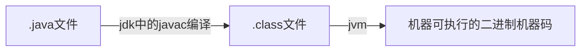

# java

## java基础

### jdk和jre的理解（jdk和jre的区别是什么）

#### JVM

java虚拟机（jvm）是运行java字节码的虚拟机。有针对不同系统的特定实现，目的是使用相同的字节码，它们都可以给出相同的结果。

**字节码？字节码的好处是什么**

jvm可以理解的代码叫做字节码（.class文件）

**java程序从源代码到运行**

**JDK和JRE**

- JDK 功能齐全的java SDK，拥有JRE所拥有的一切
- JRE java运行时环境，运行已编译Java程序所需的所有内容的集合，包括java虚拟机，java类库，java命令和其他的一些基础组件

#### 重载和重写的区别

**重载：同样的一个方法根据输入数据的不同，做出不一样的处理**

发生在同一个类中。。。

**重写：当子类继承自父类的相同方法，输入数据一样，但要做出有区别于父类的响应时就要覆盖父类方法**

发生在运行期

#### String/StringBuffer/StringBuilder

- String被final修饰，不可变
- StringBuffer是线程安全的
- StringBuilder是线程不安全的

#### 接口和抽象类的区别是什么？

抽象是对类的抽象，是一种模板设计，接口是对行为的抽象是一种行为规范

#### ==与equals

**==**

判断两个对象的地址是不是相等

- 基本数据类型==比较的是值
- 引用数据类型==比较的是内存地址

**equals**

判断两个对象是否相等

- 类没有覆盖`equals()`方法，则equals()等同于使用==比较两个对象
- 类覆盖了equals()方法，内容相等，返回true

#### hashCode与equals

hashCode() 的作用是获取哈希码

**为什么重写equals时必须重写hashCode方法**

1. 如果两个对象相等，hashCode一定相同
2. 两个对象相等，分别调用equals方法都返回true
3. 两个对象有相同的hashCode值，他们也不一定相等
4. 因此equals方法被覆盖，hashCode也必须被覆盖
5. hashCode()的默认行为是对堆上的对象产生独特值。如果没有重写hashCode方法，则该class的两个对象无论如何都不会相等

#### 反射

java反射机制是在运行时，对于任何一个类，都能够知道这个类的所有属性和方法。对于任何一个对象都能够调用它的任意一个方法和属性；

#### Java中的IO流  BIO/NIO/AIO

**Java中IO流分为几种**

- 流的流向分，输入流，输出流
- 操作单元，字节流和字符流
- 流的角色，节点流和处理流

## 集合

### Collection

#### List

有序，可重复，可通过索引值操作元素

- 底层是数组，查询快，增删慢
  - ArrayList	线程不安全，效率高
  - Vector      线程安全，效率低
- 底层是链表，查询慢，增删快
  - LinkedList	线程不安全，效率高

#### Set

无序，元素唯一

- 底层是哈希表

  - HashSet	保持元素唯一性

    hashCode（），equals（）

- 底层是二叉树

  - TreeSet	保证元素排序
    - 自然顺序，让对象所属的类去实现comparable接口，无参构造
    - 比较器接口comparator,带参构造

#### Queue

- PriorityQueue 数组来实现二叉堆
- ArrayQueue 数组+双指针

### Map

#### HashMap

数组+链表构成，当链表长度大于阈值（默认为8）（将链表转换为红黑树之前会判断，如果当前数组的长度小于64，那么会选择先进行数组扩容，而不是转红黑树）时会转化为红黑树

**put原理**

1. 空数组有无初始化，没有就初始化
2. 如果通过key的hash能够直接找到值，跳转到6，否则到3
3. 如果hash冲突的话，链表/红黑树
4. 如果是链表，递归循环，把新元素追加到队尾
5. 如果是红黑树，调用红黑树新增的方法
6. 通过2，4，5将新元素追加成功后，再根据onlyIfAbsent判断是否需要覆盖
7. 判断是否需要扩容，需要扩容进行扩容，结束

#### LinkedHashMap

继承于HashMap

#### HashTable

数组+链表组成

#### TreeMap

红黑树

## JVM

### java内存区域

**线程私有**

- 程序计数器
- 本地方法栈
- 虚拟机栈

**所有线程共享**

- MetaSpace（元空间）
- 堆（数组和类对象）

### JVM如何加载.class文件

**通过classLoader将符合其格式要求的class文件加载到内存里并通过Execution Engine来解析class文件中的字节码提交给操作系统来执行**

### 类加载器

#### 类加载器的双亲委派机制

自底向上检查类是否已经加载，自顶向下尝试加载类

> Bootstrap ClassLoader（引导类加载器）
>
> Extension ClassLoader（扩展类加载器）
>
> Application ClassLoader（系统类加载器）
>
> Custom ClassLoader（自定义类加载器）

双亲委派机制可以避免多份同样字节码的加载

#### 类的加载方式

- 隐式：new
- 显式：loadClass，forname

##### loadClass与forname的区别

- loadClass得到的class是还没有链接的
- forname得到的class是已经被初始化的

> spring IOC的延迟加载
>
> IOC中资源加载器获取要读入的资源时，即读取bin的一些配置文件时，如果以classpath的方式来加载，需要使用ClassLoader.loadClass来加载
>
> 把类的加载工作留到实际使用的时候才去做

### JVM内存分配与回收

java堆是垃圾收集器管理的主要区域

垃圾回收角度，现在收集器基本都采用分代垃圾收集算法，所以java堆还可细分为：新生代和老年代

### 堆内存中对象的分配的基本策略

- 对象优先在eden区分配
- 大对象直接进入老年代
- 长期存活的对象将进入老年代

### 如何判断对象是否已经死亡

- 引用计数法
- 可达性分析算法

#### 强引用，软引用，弱引用，虚引用

- 强引用，必不可少，垃圾回收器绝不回收
- 软引用，可有可无，内存空间不足时，回收
- 弱引用，垃圾回收线程发现了就会回收
- 虚引用，对象持有虚引用就和没有任何引用一样，在任何时候都可能被垃圾回收。主要用来跟踪对象被垃圾回收的活动

### 如何判断一个类是无用的类

- 该类的所有实例已经被回收，java堆中不存在该类的任何实例
- 加载该类的ClassLoader已经被回收
- 该类对应的`java.lang.Class`对象没有在任何地方被引用，无法在任何地方通过反射访问该类的方法

### 垃圾收集有哪些算法，各自的特点

#### 标记清除算法

标记处所有不需要回收的对象，标记完成后统一回收掉所有没有被标记的对象

缺点

- 效率问题
- 会产生大量不连续的碎片

#### 复制算法

将内存分为大小相同的两块，每次使用其中一块，当这一块用完，就将还存活的对象复制到另一块中，然把使用的空间一次清理掉

#### 标记-整理算法

标记过程与标记清除算法一样，后续步骤不是直接对可回收对象回收，而是让所有存活的对象向一端移动，然后直接清理掉端边界以外的内存。

#### 分代收集算法

一般将 java 堆分为新生代和老年代，这样我们就可以根据各个年代的特点选择合适的垃圾收集算法

### JVM三大性能调优参数  -Xss -Xmx -Xss的含义

- -Xss：规定了每个线程虚拟机栈的大小
- -Xms ：堆的初始值
- -Xmx：堆能达到的最大值

## 问题

## Java并发

### sleep()方法和wait()方法的区别和共同点

- 两者的区别在于，sleep()方法没有释放锁，wait()方法释放了锁
- 两者都可以暂停线程的执行
- wait通常被用于线程间交互/通信，sleep通常用于暂停执行
- wait方法被调用后，线程不会自动苏醒，需要等别的线程调用同一个对象上的notify()/notifyAll()。sleep方法执行完成后，线程自动苏醒。

### 为什么我们调用start()方法时会执行run()方法，为什么不能直接调用run()方法

 **调用start方法方可启动线程并使线程进入就绪状态，而run方法只是thread的一个普通方法调用，还是在主线程里执行**

### synchronized关键字

#### 使用方式

1. 修饰实例方法

   给当前对象实例加锁

2. 修饰静态方法

   给当前类加锁

3. 修饰代码块

   `synchronized(this|object)` 表示进入同步代码块要获取给定对象的锁

   `synchronized(类.class)`表示要获取当前class的锁

#### 双重校验锁实现对象单例（线程安全）

~~~java
public	class	Singleton{
    private	volatite static Singleton uniqueInstance;
    private Singleton(){
        
    }
    public	static	Singleton	getUniqueInstance(){
        //先判断对象是否被实例化过，没有实例化才进入加锁代码
        if(uniqueInstance==null){
            //给类对象加锁
            synchronized(Singleton.class){
                if(uniqueInstance==null){
                    uniqueInstance=new	Singleton();
                }
            }
        }
        return uniqueInstance;
    }
}
~~~

#### synchronized和ReentrantLock的区别

- 两者都是可重入锁
- synchronized依赖于JVM，ReentrantLock依赖于API
- ReentrantLock比synchronized增加了一些高级功能
  - 等待可中断
  - 可实现公平锁
  - 可实现选择性通知

### volatile 关键字

**（联合JMM来想）**

**`volatile` 关键字 除了防止 JVM 的指令重排 ，还有一个重要的作用就是保证变量的可见性。**

变量声明为**`volatile`**，这就指示 JVM，这个变量是共享且不稳定的，每次使用它都到主存中进行读取

### synchronized 关键字和 volatile 关键字的区别

synchronized 和 volatile 是互补的

- volatile 是线程同步的轻量级实现，volatile 只能用于变量，而synchronized 可以哦修饰方法以及代码块
- volatile 只能保持数据的可见性，synchronized 能保持原子性和可见性
- volatile 主要用于解决变量在多个线程之间的可见性。而synchronized 解决的是多个线程访问资源的同步性

### jvm内存结构与java内存模型（JMM）的区别

**jvm内存结构**

Java 虚拟机在执行 Java 程序的过程中会把它管理的内存划分成若干个不同的数据区域

线程私有：虚拟机栈，本地方法栈，程序计数器

所有线程共享：元空间，堆

**JMM**

java内存模型其实是一个抽象概念，描述了一种规则或规范。定义程序中各个变量的访问方式

### Java创建线程的四种方式

- 继承Thread类实现多线程
- 覆写Runnable()接口实现多线程，而后同样覆写run()，推荐此方式
  - 继承Thread和实现Runnable()接口的区别
    - 实现Runnable()避免多继承局限
    - 实现Runnable()可以更好的体现共享的概念
- 覆写Callable接口实现多线程
- 通过线程池启动多线程

### ThreadPoolExecutor的重要参数

- corePoolSize

  核心线程数

- maxPoolSize：最大线程数

- queueCapacity：任务队列容量（阻塞队列）

- keepAliveTime

  当创建的线程数超过核心线程数限制，超出的线程最大的空闲时间，超过这个时间会被回收

- allowCoreThreadTimeout：允许核心线程超时

- rejectedExecutionHandler：任务拒绝处理器

